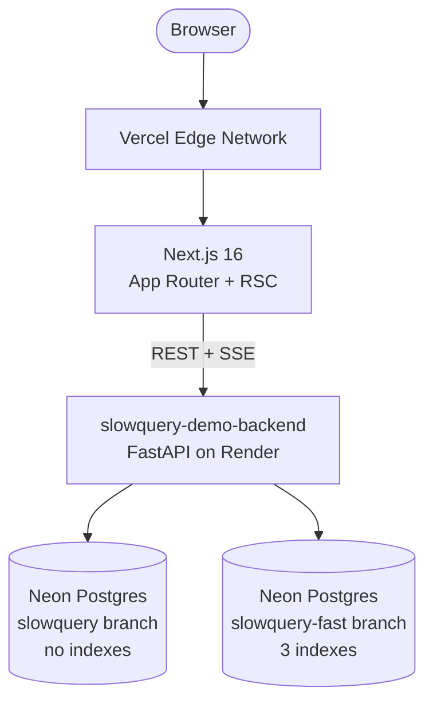
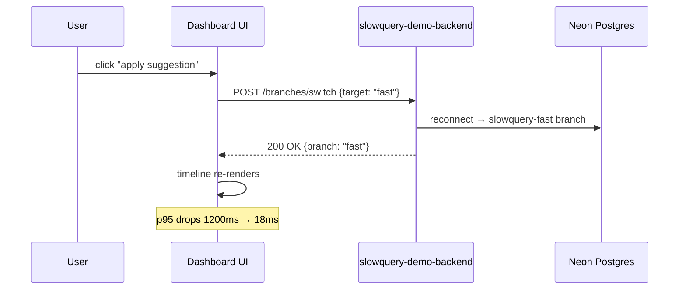
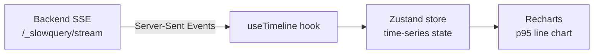

# 📊 `slowquery-dashboard-frontend`

> 🖥️ **Next.js 16 terminal-styled dashboard for the slowquery-detective pipeline.**
> Live fingerprints table, EXPLAIN viewer with Monaco, p95 timeline via SSE, and one-click branch switch that drops latency from 1200ms to 18ms.

🌐 [Live Dashboard](https://slowquery-dashboard-frontend.vercel.app) · 🔙 [Backend API](https://slowquery-demo-backend.onrender.com) · 🔙 [Backend Repo](https://github.com/Abdul-Muizz1310/slowquery-demo-backend) · 📦 [slowquery-detective](https://pypi.org/project/slowquery-detective/) · 📐 [Specs](docs/specs/)


[](https://github.com/Abdul-Muizz1310/slowquery-dashboard-frontend/actions/workflows/ci.yml)


---

```console
$ pnpm dev
  ▲ Next.js 16.0.0 (Turbopack)
  - Local:   http://localhost:3000
  - Backend: https://slowquery-demo-backend.onrender.com

[/]          7 fingerprints loaded · sorted by total_ms desc
[/queries/c168] Monaco: SELECT … ORDER BY created_at DESC
               EXPLAIN: Seq Scan on orders · cost 14209 · rows 100000
               suggestion: CREATE INDEX ix_orders_created_at
[/timeline]  SSE connected · 7 series · p95 updating live
[apply]      POST /branches/switch → fast branch
[timeline]   p95 re-rendering · 1200ms → 18ms ✓
```

---

## 🎯 Why this exists

Phase 4c of the [slowquery-detective](https://pypi.org/project/slowquery-detective/) portfolio project. The PyPI middleware captures slow queries; the [demo backend](https://github.com/Abdul-Muizz1310/slowquery-demo-backend) runs them against seeded commerce data on Neon; **this dashboard** makes the pipeline visible and interactive.

The demo's punchline: click "apply suggestion" and watch the p95 timeline drop from **1200ms to 18ms** in real time — that's the difference between a missing index and an indexed column on 100k rows.

---

## ✨ Features

- 📋 Fingerprints table sorted by `total_ms` desc with p50/p95/p99, call counts, and rule badges
- 🔍 Single-fingerprint detail with canonical SQL in Monaco editor
- 📊 EXPLAIN plan JSON with postgres-plan highlighter
- 💡 Suggestion cards — rule-sourced first, LLM fallback second
- 📈 Live p95 line chart per fingerprint via Server-Sent Events
- 🔀 One-click branch switch: slow → fast Neon branch (1200ms → 18ms)
- 🖥️ Terminal aesthetic — dark mode, monospace, grid backgrounds
- 🎬 Chromeless `/demo` view for README gifs
- 🛡️ Zod validation at every API boundary
- ✅ 124 vitest tests across 20 test files — red-first TDD

---

## 🏗️ Architecture



### 🔀 Branch switch flow



### 📡 SSE timeline data flow



---

## 🗂️ Project structure

```
src/
├── app/
│   ├── page.tsx                 # / — fingerprints table
│   ├── layout.tsx               # Root layout + terminal chrome
│   ├── queries/[id]/
│   │   └── page.tsx             # Single fingerprint detail
│   ├── timeline/
│   │   └── page.tsx             # Live p95 chart via SSE
│   └── demo/
│       └── page.tsx             # Chromeless demo view
├── components/
│   ├── FingerprintsTable.tsx    # Sortable table with rule badges
│   ├── QueryDetail.tsx          # Monaco + EXPLAIN + suggestions
│   ├── TimelineChart.tsx        # Recharts p95 line chart
│   ├── BranchSwitch.tsx         # Slow ↔ fast toggle
│   └── SuggestionCard.tsx       # Rule / LLM suggestion display
└── lib/
    ├── api.ts                   # REST fetch + Zod parsing
    ├── sse.ts                   # SSE hook for timeline stream
    ├── store.ts                 # Zustand time-series state
    └── schemas.ts               # Zod schemas for all API shapes
```

---

## 🗺️ Routes

| Route | Purpose |
|---|---|
| `/` | 📋 Fingerprints table — sorted by `total_ms` desc, rule badges, p50/p95/p99 |
| `/queries/[id]` | 🔍 Detail — Monaco SQL, EXPLAIN JSON, suggestion cards |
| `/timeline` | 📈 Live p95 line chart per fingerprint via SSE |
| `/demo` | 🎬 Chromeless view — fingerprints + timeline + branch switch |

---

## 🛠️ Stack

| Concern | Choice |
|---|---|
| **Framework** | Next.js 16 (App Router, React Server Components) |
| **UI** | React 19 · TypeScript 5 strict |
| **Styling** | Tailwind CSS v4 via `@tailwindcss/postcss` |
| **Charts** | Recharts |
| **Code viewer** | Monaco via `@monaco-editor/react` |
| **Validation** | Zod at all backend/API boundaries |
| **State** | Zustand (timeline store) |
| **Testing** | Vitest 4 + Testing Library + jsdom (124 tests) · Playwright (E2E) |
| **Lint / Format** | Biome 2 |
| **Package manager** | pnpm 10, Node 24 |
| **Hosting** | Vercel Hobby, auto-deploy on push to main |

---

## 🚀 Run locally

```bash
# 1. clone & install
git clone https://github.com/Abdul-Muizz1310/slowquery-dashboard-frontend.git
cd slowquery-dashboard-frontend
pnpm install

# 2. env
cp .env.example .env.local
# point at the live Render backend or your own

# 3. dev
pnpm dev
# → http://localhost:3000
```

### 📜 Scripts

```bash
pnpm dev                                    # Next.js dev server
pnpm build                                  # production build
pnpm test                                   # unit tests (Vitest)
pnpm test:e2e                               # Playwright E2E
pnpm lint && pnpm typecheck && pnpm build   # full CI gate locally
```

---

## 🧪 Testing

```bash
pnpm test                    # watch mode
pnpm test -- --run           # CI single-run
pnpm test:e2e                # Playwright chromium
```

| Metric | Value |
|---|---|
| **Unit tests** | 124 tests across 20 files (Vitest + jsdom) |
| **E2E** | Playwright (chromium only) |
| **Methodology** | Red-first spec-TDD. Every spec in `docs/specs/` with enumerated test cases before code ships. |

---

## 📐 Engineering philosophy

| Principle | How it shows up |
|---|---|
| 🧪 **Spec-TDD** | Every feature has a spec in `docs/specs/` with enumerated test cases before code ships. 124 tests all green. |
| 🛡️ **Negative-space programming** | Zod parse at every boundary, discriminated unions for suggestion kinds, `Literal` types for branch targets. |
| 🏗️ **Separation of concerns** | `app/` thin routes · `components/` dumb presentational · `lib/` owns side effects. |
| 🔤 **Typed everything** | TypeScript 5 strict, no `any`. Zod-inferred types flow end-to-end. |
| 🌊 **Pure core, imperative shell** | Fetchers and SSE wiring live at the edges; presentation components are dumb and unit-testable. |

---

## 🚀 Deploy

Hosted on **Vercel Hobby**. Push to `main` → Vercel build → auto-deploy.

Backend: [`slowquery-demo-backend`](https://github.com/Abdul-Muizz1310/slowquery-demo-backend) on Render free tier.

---

## 📄 License

MIT. See [LICENSE](LICENSE).

---

> 📊 **`slowquery-dashboard --help`** · watch your queries get faster in real time
