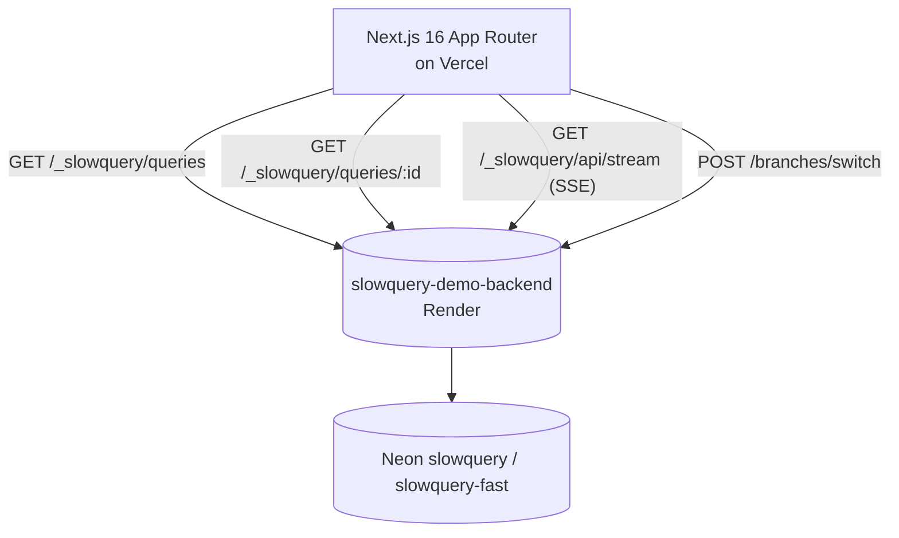

# Architecture

> Stub — replaced with the real Mermaid diagram and component map at S6.

## Shape (planned)



## Layers (planned)

```
src/app/              →  routes (RSC by default; client components for SSE + Monaco)
src/components/       →  presentational, prop-driven, unit-testable
src/features/         →  feature modules (fingerprints, queries, timeline, branches)
src/lib/              →  env parsing, fetch client, Zod schemas, SSE helper
tests/                →  vitest unit tests
tests/e2e/            →  Playwright flows
```

See [`docs/specs/`](specs/) for the feature-by-feature design (added in S2).
