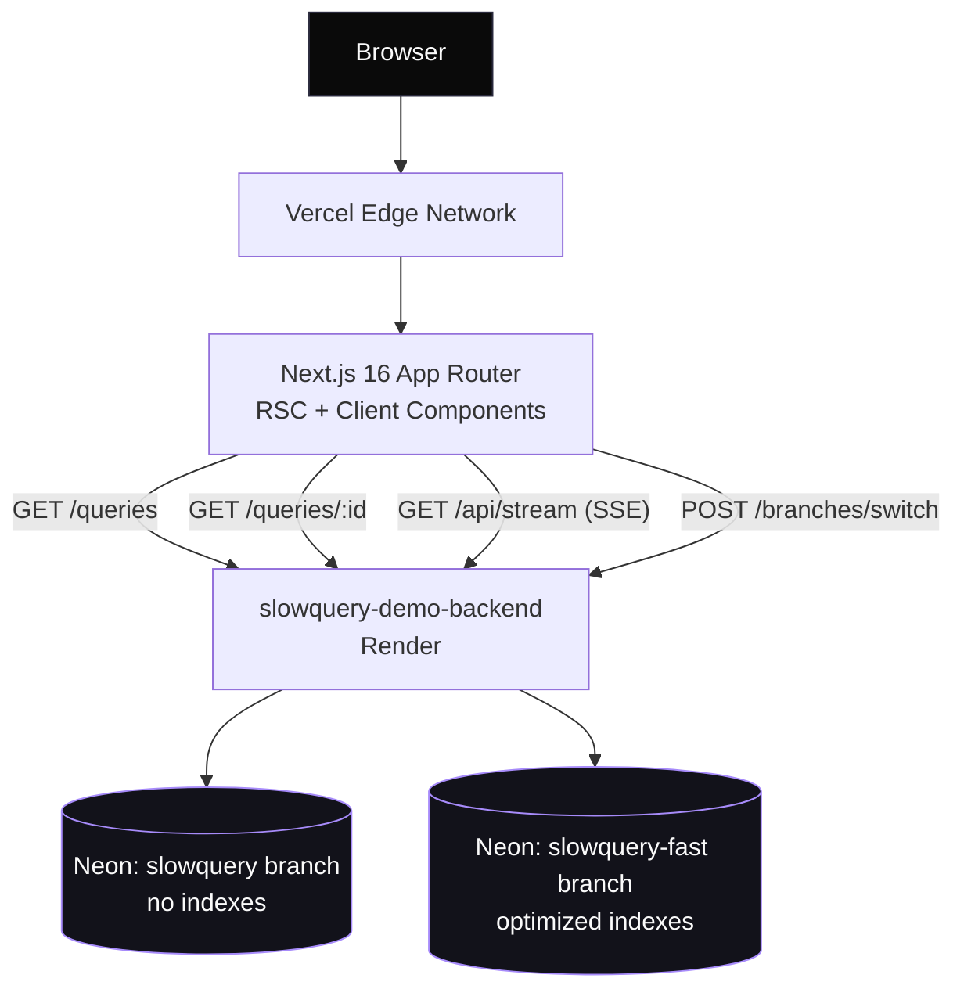
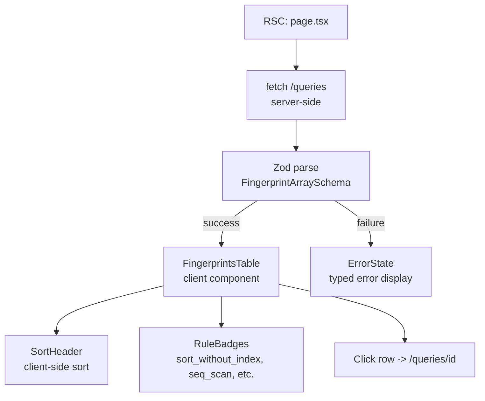
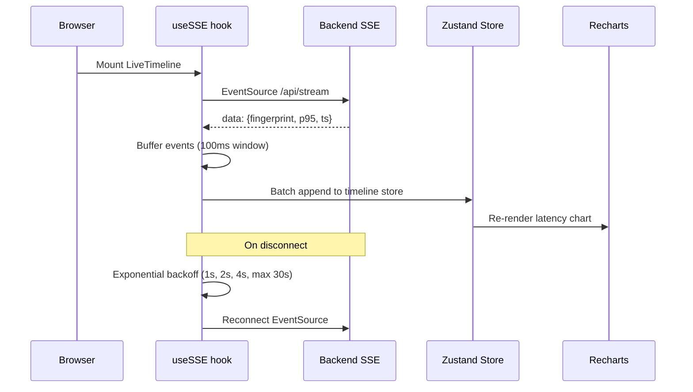
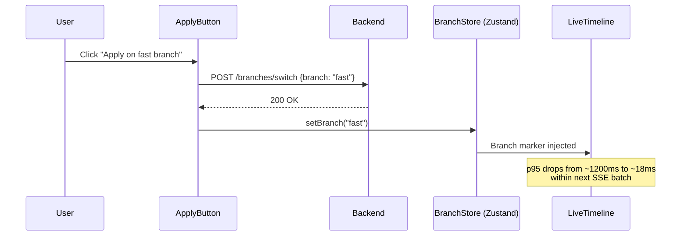

# Architecture

The slowquery dashboard is a Next.js 16 App Router application deployed on Vercel. It is the frontend for `slowquery-demo-backend` (FastAPI on Render), which runs slow queries against two Neon Postgres branches to demonstrate index-driven performance improvements.

## System context

## Component map

| Layer | Module | Purpose | Key files |
|---|---|---|---|
| Routes | `/` | Fingerprints table (landing page) | `src/app/page.tsx` |
| Routes | `/queries/[id]` | Query detail: SQL, EXPLAIN, suggestions | `src/app/queries/[id]/page.tsx` |
| Routes | `/timeline` | Live latency chart via SSE | `src/app/timeline/page.tsx` |
| Routes | `/demo` | Guided demo panel for interviews | `src/app/demo/page.tsx`, `demo-panel.tsx` |
| Terminal UI | AppNav, PageFrame, StatusBar, TerminalWindow | Shared shell with terminal aesthetic | `src/components/terminal/` |
| Feature | fingerprints | Table, sort, rule badges, Zod parse | `src/features/fingerprints/` |
| Feature | query-detail | Canonical SQL, EXPLAIN plan viewer, suggestion card | `src/features/query-detail/` |
| Feature | timeline | Live SSE chart, backoff, buffer, branch markers | `src/features/timeline/` |
| Feature | branches | Apply button, branch indicator, Zustand store | `src/features/branches/` |
| Lib | api/client | Typed fetch wrapper with error handling | `src/lib/api/client.ts` |
| Lib | api/schemas | Zod schemas for all API responses | `src/lib/api/schemas.ts` |
| Lib | api/errors | Discriminated error union (network, parse, http) | `src/lib/api/errors.ts` |
| Lib | api/sse | SSE helper with reconnection logic | `src/lib/api/sse.ts` |
| Lib | env | Runtime env parsing via Zod | `src/lib/env.ts` |

## Data flow: fingerprints page

## SSE timeline

## Branch switch

## Feature module structure

Each feature directory (`src/features/*`) is self-contained:

- **Components** — React client components scoped to that feature
- **Parse** — Zod parsing functions that validate API data at the boundary
- **Format** — Pure display formatters (duration, percentiles, SQL highlighting)
- **Store** (where needed) — Zustand slice for client-side state (branches, timeline buffer)
- **Error routing** — Maps typed error unions to user-facing messages

Features import from `src/lib/` but never from each other. The `lib/api/` layer owns all network calls and Zod schemas; features consume parsed, typed data.

## Invariants

1. **Zod at every boundary** — all API responses are parsed through Zod schemas before reaching components. No `any` types cross module boundaries.
2. **Typed error union** — network errors, HTTP errors, and parse errors are discriminated (`{ tag: "network" } | { tag: "http", status } | { tag: "parse", issues }`). Components pattern-match on the tag to render appropriate error states.
3. **Discriminated suggestions** — query optimization suggestions carry a `kind` field (`rule_based | llm_fallback`) so the UI can distinguish deterministic rule matches from LLM-generated advice.
4. **SSE reconnection** — the SSE hook uses exponential backoff with jitter. It never silently drops the connection; the StatusBar reflects connection state.
5. **Branch state is global** — the active Neon branch lives in a Zustand store so the timeline, fingerprints table, and apply button stay in sync without prop drilling.
6. **Server Components by default** — only components that need browser APIs (EventSource, Zustand, Monaco) are marked `"use client"`. Pages fetch data server-side.
