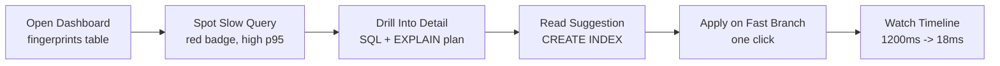

# Demo Script

Step-by-step demo for interviews. Takes ~3 minutes. The story arc: see a slow query, understand why it is slow, apply a fix, and watch latency drop in real time.

## Prerequisites

- Browser (Chrome recommended for DevTools)
- Backend must be awake — Render free tier sleeps after 15 minutes of inactivity
- If the backend is cold, the first request takes ~30 seconds to spin up

## URLs

| Environment | URL |
|---|---|
| Frontend (Vercel) | https://slowquery-dashboard-frontend.vercel.app |
| Backend (Render) | https://slowquery-demo-backend.onrender.com |
| Backend health | https://slowquery-demo-backend.onrender.com/health |

## Setup

1. Open the frontend URL in a browser
2. If you see a connection error, the backend is cold-starting — wait 30 seconds and refresh
3. Optionally open DevTools Network tab to show SSE and API calls during the demo

## Step-by-step walkthrough

### 1. Fingerprints table (30s)

1. The landing page (`/`) shows a table of query fingerprints sorted by p95 latency
2. Point out the top row: an `ORDER BY created_at DESC` query with p95 around 1200ms
3. Note the red `sort_without_index` badge — this is a rule-based detection, not an LLM guess
4. Click the column headers to re-sort by total time, call count, or p95

### 2. Query detail (30s)

1. Click the slow query row to navigate to `/queries/[id]`
2. **Canonical SQL** — the normalized query pattern with parameter placeholders
3. **EXPLAIN plan viewer** — collapsible tree showing the `Sort` node as the top cost driver
4. **Recent samples table** — actual execution times for this fingerprint
5. **Suggestion card** — `CREATE INDEX IF NOT EXISTS ix_orders_created_at ON orders(created_at)` with a `rule_based` tag

### 3. Apply the fix (15s)

1. Click **"Apply on fast branch"** in the suggestion card
2. This POSTs to `/branches/switch` on the backend
3. The backend switches from the `slowquery` Neon branch (no indexes) to `slowquery-fast` (optimized indexes)
4. A toast confirms the branch switch

### 4. Watch the timeline (30s)

1. Navigate to `/timeline`
2. The live SSE chart shows latency over time via Recharts
3. A vertical branch marker appears where the switch happened
4. Within the next few data points, p95 drops from ~1200ms to ~18ms
5. This is the money shot — the fix worked, the dashboard detected it, all in real time

### 5. Explore the demo page (30s)

1. Navigate to `/demo` for a guided version of the above flow
2. The demo panel walks through each step with annotations
3. Useful if you want a scripted version instead of free-form navigation

## Talking points

- **Rules-first, LLM-second** — suggestions come from deterministic EXPLAIN plan pattern matching. LLM is the fallback, not the headline.
- **Two Neon branches, one click** — identical data, different indexes. The branch switch proves the optimization without modifying production.
- **Live SSE timeline** — not polling on an interval, but server-sent events with exponential backoff reconnection.
- **Zod at every boundary** — all API responses are parsed and validated before rendering. Type errors surface immediately, not in production.
- **Terminal aesthetic** — the UI uses a custom terminal-style chrome that differentiates it from generic dashboard templates.

## Fallbacks

| Issue | What to do |
|---|---|
| Backend is sleeping (Render free tier) | Wait ~30s for cold start. Hit `/health` endpoint to wake it. |
| No data in fingerprints table | The backend seeds demo data on startup. If the table is empty, the backend may still be initializing — refresh after a few seconds. |
| SSE timeline not updating | Check DevTools for EventSource connection. If disconnected, the hook will auto-reconnect with backoff. Refresh as a last resort. |
| Branch switch returns error | The backend may need a moment after cold start. Wait 5 seconds and retry. |
| Suggestion card shows "llm_fallback" | This means the rule engine did not match a known pattern. The demo queries should always match rules — if you see this, the backend may be returning unexpected data. |
